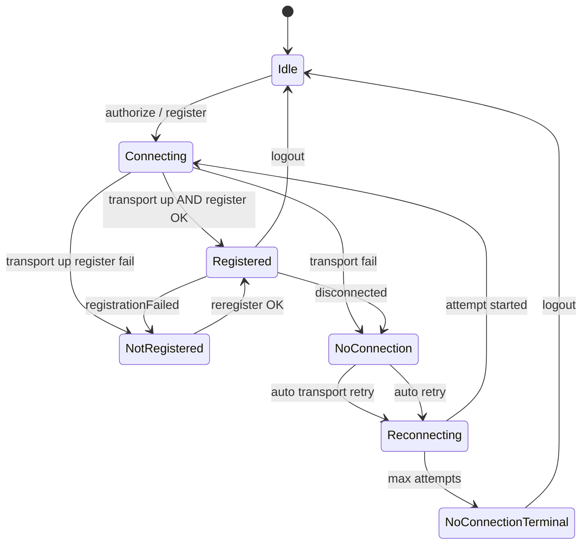

# Transport + Register State Refactoring Plan

> **Status:** `done` — master plan for SIP transport/registration UX and domain refactor (closed 2026-07-02).  
> **Scope:** SIP-only. OCP is **out of scope** (deep backlog, ADR-0002).  
> **Features:** F-001, F-014, F-016 (+ partial F-017 diagnostics surface).  
> **Legacy:** LF-008, LF-009, LF-010, LF-011 (supersedes LF-057 overlay / LF-009 avatar ring).

---

## 0. Agent execution protocol

### How to run an agent on this plan

Open a **new Agent chat** and paste **one** of the prompts below. The agent must work **phase by phase**, marking checkboxes in **§12 Progress** before moving on.

#### Start (first session)

```text
Выполни план docs/softphone/TRANSPORT-REGISTER-STATE-REFACTORING.md.
Прочитай план целиком, STATUS.md, Architecture-Constitution.md, Feature-Registry.md.
Начни с Phase 0. Не пропускай фазы. После каждой фазы обнови §12 Progress в этом файле и создай work-history.
OCP не трогай. SIP-only.
```

#### Continue (next sessions)

```text
Продолжи docs/softphone/TRANSPORT-REGISTER-STATE-REFACTORING.md с первой незакрытой фазы в §12 Progress.
Прочитай §12 и git diff. Заверши текущую фазу полностью (тесты + lint), обнови §12, work-history.
```

#### Phase-only (narrow scope)

```text
Выполни только Phase N из docs/softphone/TRANSPORT-REGISTER-STATE-REFACTORING.md.
Обнови §12 Progress. OCP не трогай.
```

Replace `N` with `0`…`7`.

### Agent rules (mandatory)

| Rule | Source |
| --- | --- |
| Layers: UI → Application → Domain → Ports → Adapters | `Architecture-Constitution.md` |
| No `any`, no `@deprecated` | `typescript-react-electron.mdc` |
| Feature Registry before code | `feature-registry.mdc` |
| Russian user-visible copy | `ux-ui-electron-react.mdc` |
| Work-history after each closed phase | `work-history.mdc` |
| JsSIP only in `src/adapters/telephony/jssip/` | `JSSIP-FORK.md` |
| Do **not** bump `package.json` version per phase | `version-release.mdc` |

### Recommended command per phase

| Phase | Command | Why |
| --- | --- | --- |
| 0 | `/arch-review` then implement ADR | Design gate |
| 1 | `/logic` | Domain + Application core |
| 2 | `/adapter` | JsSIP adapter |
| 3 | `/logic` | Orchestration + Use Cases |
| 4 | `/logic` | Projections |
| 5–6 | `/ui` | Header + Settings module |
| 7 | `/preflight` → `/review` | Gate |

### Definition of done (whole plan)

- [x] All §12 phase checkboxes checked
- [x] `npm run test && npm run lint && npm run typecheck` green
- [x] Feature Registry F-001, F-014, F-016 updated
- [x] ConnectionOverlay removed; no OCP recovery UI in SIP-only path
- [x] Header shows unified SIP status per §4
- [x] Settings **«Состояние системы»** module live per §5
- [x] No user-selectable online/offline presence (auth + logout only)

---

## 1. Locked product contract

Decisions confirmed by product owner (2026-07-02).

### 1.1 Single header indicator

One dot + one status line. **Priority (high → low):**

1. **Lifecycle idle** — user opened app, no auth attempt yet
2. **Transport** — connecting → reconnecting → disconnected (terminal)
3. **Registration** — registering → not registered / failed
4. **Registered** — healthy SIP session
5. **DND** — only when `isConnected && isRegistered && dndEnabled`

**Invariant:** `effectiveRegistered = isConnected && ua.isRegistered()`.  
If transport is down, registration state in projections **must not** show `registered`.

### 1.2 Header labels (Russian)

| Condition | Dot color | Primary label | Timer suffix |
| --- | --- | --- | --- |
| Idle (no session) | gray | **Не подключено** | — |
| Transport connecting | orange | **Соединение** | — |
| Transport reconnecting (auto on) | red | **Нет соединения** | `(переподкл. MM:SS)` |
| Transport disconnected (terminal / manual off) | red | **Нет соединения** | — |
| Transport connected, REGISTER in flight | orange | **Соединение** | — |
| Transport connected, REGISTER retry (auto on) | red/orange | **Не зарегистрирован** | `(перерег. MM:SS)` |
| Transport connected, not registered (manual) | red | **Не зарегистрирован** | — |
| Registered | green | **Зарегистрирован** | — |
| Registered + DND | green (dnd tone) | **Не беспокоить** | — |

**Note:** Transport failure uses **«Нет соединения»** (not «Оффлайн») to avoid confusion with removed presence offline.

During active call + socket drop: header shows **«Нет соединения»** immediately; recovery scheduling resumes after call ends (Q6).

### 1.3 Auth model — no presence offline/online

- User **cannot** choose online/offline presence.
- Flow: **authorize** → work → **logout** (with full teardown).
- No «снятие с линии» as separate concept.
- **DND** may remain as optional flag when registered (if already in product); not a transport state.

### 1.4 Logout teardown

```
hangupAll → unregister({ all: true }) → ua.stop() / disconnect → SipSessionReset → idle
```

- All recovery timers cleared.
- Header → **Не подключено**.
- Credentials: keep for now (saved profiles later); clear on logout only when product adds profiles.

### 1.5 Recovery pipeline (strict order)

```txt
Transport disconnect
  → registration projection cleared (not registered)
  → transport reconnect attempts (if auto enabled)
  → on transport connected
      → registration attempts (if auto enabled)
```

**Never** run registration retry while transport ≠ `connected`.

### 1.6 Manual actions (Settings only)

| Action | Meaning | Side effect |
| --- | --- | --- |
| **Переподключить сокет** | Reconnect WebSocket | Reset countdown to full interval; **attempt number unchanged** |
| **Перерегистрировать** | SIP REGISTER on open socket | Same timer rule; only if `isConnected` |
| **Обновить регистрацию** | `unregister({ all: true })` then `register()` | Proactive refresh |

Remove: `ConnectionOverlay`, header `control-reregister-sip`, overlay manual retry.

### 1.7 Auth errors (401/403)

Stop auto-retry immediately. User message:

```txt
Переподключение прервано. Ошибка: {code} {text}. Проверьте логин/пароль
```

### 1.8 Settings module: «Состояние системы»

New settings section (see §5). Replaces recovery overlay + splits policy from diagnostics logs.

### 1.9 Explicitly out of scope

- OCP recovery UI and orchestration wiring
- Avatar recovery ring (LF-009 cancelled for this product)
- `navigator.onLine` handling
- Tray notifications on disconnect
- `registrationExpiring` UI (JsSIP handles internally — ignore)

---

## 2. JsSIP reference (implementation)

Source: [JsSIP Documentation](https://jssip.net/documentation/), Context7 `/versatica/jssip`, fork `@hailrase/jssip` ^3.10.2.

### 2.1 Events to handle in adapter

| Event | Layer | Action |
| --- | --- | --- |
| `connecting` | Transport | Publish `SipTransportConnecting` |
| `connected` | Transport | Publish `SipTransportConnected` |
| `disconnected` | Transport | Publish `SipTransportDisconnected`; clear effective registration |
| `registered` | REGISTER | Existing success path |
| `unregistered` | REGISTER | Clear registration |
| `registrationFailed` | REGISTER | Orchestration registration retry (if transport up) |
| `registrationExpiring` | REGISTER | **Ignore** (no UI) |
| `newRTCSession` | Calls | Unchanged |

### 2.2 Status methods

```javascript
// Effective registration for UI and guards:
effectiveRegistered = ua.isConnected() && ua.isRegistered()
```

### 2.3 UA configuration (keep)

```typescript
register: false  // app calls ua.register() explicitly
connection_recovery_min_interval: 300  // seconds — defer to app orchestration
connection_recovery_max_interval: 300
```

App orchestration owns visible timers/attempts. JsSIP internal reconnect stays high-interval fallback.

### 2.4 Transport vs registration failure

| Failure | Meaning |
| --- | --- |
| **Transport** | WebSocket down; no SIP messages |
| **Registration** | Socket up; SIP REGISTER response error (403, 401, etc.) |

If a SIP response arrives, classify as **registration**, not transport.

---

## 3. Target architecture

### 3.1 Domain: `SipSessionHealth`

Two orthogonal axes + lifecycle:

```typescript
type SipLifecyclePhase = "idle" | "active";

type SipTransportState =
  | "idle"
  | "connecting"
  | "connected"
  | "reconnecting"
  | "disconnected";  // terminal until manual or new auth

type SipRegistrationState =
  | "idle"       // transport down or never attempted
  | "registering"
  | "registered"
  | "failed";

type SipRecoveryTarget = "transport" | "registration";

type SipRecoverySnapshot = Readonly<{
  target: SipRecoveryTarget | null;
  attemptNumber: number;
  maxAttempts: number;
  nextRetryAt: string | null;
  lastFailureReason: string | null;
}>;
```

**Domain invariants** (unit-tested):

- `transport !== "connected"` ⇒ `registration` effective = `idle`
- `recovery.target === "registration"` ⇒ `transport === "connected"`
- `recovery.target === "transport"` ⇒ no registration retry in flight
- Logout ⇒ `lifecycle === "idle"`, all recovery null

### 3.2 Domain events (new / changed)

| Event | When |
| --- | --- |
| `SipSessionActivated` | First auth/register attempt |
| `SipSessionReset` | Logout / teardown → idle |
| `SipTransportConnecting` | JsSIP `connecting` |
| `SipTransportConnected` | JsSIP `connected` |
| `SipTransportDisconnected` | JsSIP `disconnected` (non-intentional) |
| `SipTransportReconnectScheduled` | App transport retry scheduled |
| `SipTransportReconnectAttemptStarted` | App transport retry started |
| `SipTransportReconnectSucceeded` | Transport restored |
| `SipTransportReconnectFailed` | Terminal transport failure |
| `SipRegistrationCleared` | Transport lost — registration invalidated |
| `SipRegistrationRetryScheduled` | App REGISTER retry scheduled |
| `SipRegistrationRetryAttemptStarted` | App REGISTER retry started |
| `SipRegistrationRetrySucceeded` | REGISTER restored |
| `SipRegistrationRetryFailed` | Terminal registration failure |
| `RegistrationRequested/Succeeded/Failed` | Keep; guard with transport |
| `ManualSipTransportReconnectRequested` | User action from settings |
| `ManualSipReregisterRequested` | User action from settings |

**Remove from SIP-only path:** dependency on `OcpDisconnected`, `ConnectionOverlay` states.

`SipTransportReconnectSucceeded` must **not** publish `RegistrationSucceeded` (transport only).  
`SipRegistrationRetrySucceeded` **must** publish `RegistrationSucceeded` when account id known.

### 3.3 Application

| Component | Change |
| --- | --- |
| `ConnectionRecoveryOrchestrationService` | Refactor → `SipRecoveryOrchestrationService` (SIP-only) |
| `RetryConnectionUseCase` | Replace → `ManualSipTransportReconnectUseCase` |
| `ReregisterSipUseCase` | Keep; add guards (transport connected) |
| New | `ForceRefreshSipRegistrationUseCase` (unregister all + register) |
| New | `sipSessionHealthProjection` reducer |
| `deriveHeaderChromeShell` | Replace registration logic → `deriveSipStatusShell` |
| New | `deriveSipSystemStateShell` (settings panel) |

### 3.4 Adapter (`JsSipTelephonyAdapter`)

- Listen `connecting`, `connected`, `disconnected`
- Port: `setTransportConnectedHandler`, `setTransportConnectingHandler`
- `effectiveIsRegistered()` helper used in gateway checks
- `forceRefreshRegistration(correlationId)` for manual refresh
- On `disconnected`: emit transport event; do not trust stale `isRegistered()`

### 3.5 UI

**Header:** dot + `UserHeaderIdentity` presence line becomes **SIP status line** (not online/offline presence).

**Remove:**

- `ConnectionOverlay`, `RecoveryFeatureShell`
- `control-reregister-sip` in header
- OCP rows in recovery projections
- User menu online/offline toggles (if present)

**Add:**

- Settings nav item **«Состояние системы»** (`system-state`)
- `SettingsSystemStatePanel` — status + policies + manual actions + filtered logs

---

## 4. Header UX state machine



---

## 5. Settings — «Состояние системы» module

### 5.1 Navigation

Add to `settingsSections.ts`:

```typescript
{
  id: "system-state",
  label: "Состояние системы",
  iconId: "settings.system-state", // add to icon catalog + registry
  testId: "settings-nav-system-state",
}
```

Place after **«Сессии»**, before **«Диагностика»**.

### 5.2 Panel layout

```txt
┌─ Состояние системы ─────────────────────────────────────┐
│ Текущее состояние                                        │
│   Сокет:      [connected / connecting / …]  + raw reason │
│   Регистрация:[registered / registering / …]             │
│   Сводка:     [header label mirror]                      │
├──────────────────────────────────────────────────────────┤
│ Автоматическое восстановление                            │
│   [x] Авто-переподключение сокета                        │
│   Интервал (сек): [5]   Попыток: [5]                     │
│   [x] Авто-перерегистрация                               │
│   Интервал (сек): [5]   Попыток: [5]                     │
│   [ ] Авто-регистрация при запуске (future-ready toggle) │
├──────────────────────────────────────────────────────────┤
│ Ручные действия                                          │
│   [Переподключить сокет]  [Перерегистрировать]           │
│   [Обновить регистрацию]                                 │
│   disabled reasons under each button                     │
├──────────────────────────────────────────────────────────┤
│ Журнал (transport + registration)                          │
│   scrollable, last N events, correlationId, timestamp    │
│   [Очистить журнал]                                      │
└──────────────────────────────────────────────────────────┘
```

### 5.3 UserSettings v2 fields

| Field | Type | Default |
| --- | --- | --- |
| `sipAutoReconnectEnabled` | `boolean` | `true` |
| `sipReconnectIntervalSec` | `number` | `5` |
| `sipReconnectMaxAttempts` | `number` | `5` |
| `sipAutoReregisterEnabled` | `boolean` | `true` (existing) |
| `sipReregisterIntervalSec` | `number` | `5` (existing) |
| `sipReregisterMaxAttempts` | `number` | `5` (existing) |
| `sipAutoRegisterOnStartup` | `boolean` | `false` |

Migrate v1 → v2 in `migrateUserSettings.ts`. Move SIP recovery toggles from General panel to System State panel.

### 5.4 Diagnostics section

Keep **«Диагностика»** for future F-017 (export, audio).  
System State journal is **SIP connection/register only** — lightweight in-memory ring buffer in application layer.

---

## 6. Current → target file map

### 6.1 Create

| Path | Purpose |
| --- | --- |
| `docs/softphone/adr/ADR-0004-sip-session-health.md` | Architecture decision |
| `src/domain/telephony/SipTransportState.ts` | Transport FSM |
| `src/domain/telephony/SipSessionHealth.ts` | Value object + invariants |
| `src/domain/telephony/events/sipTransportEvents.ts` | Transport domain events |
| `src/application/projections/sipSessionHealthProjection.ts` | Unified read model |
| `src/application/projections/deriveSipStatusShell.ts` | Header VM |
| `src/application/projections/deriveSipSystemStateShell.ts` | Settings panel VM |
| `src/application/services/SipRecoveryOrchestrationService.ts` | SIP-only orchestrator |
| `src/application/use-cases/ManualSipTransportReconnectUseCase.ts` | Manual socket reconnect |
| `src/application/use-cases/ForceRefreshSipRegistrationUseCase.ts` | unregister all + register |
| `src/application/services/SipConnectionJournal.ts` | In-memory log ring |
| `src/renderer/components/settings/panels/SettingsSystemStatePanel.tsx` | UI panel |

### 6.2 Modify

| Path | Change |
| --- | --- |
| `src/adapters/telephony/jssip/JsSipTelephonyAdapter.ts` | Transport events, effective registered |
| `src/adapters/telephony/jssip/JsSipUaPort.ts` | New event names in port |
| `src/ports/telephony/TelephonyGateway.ts` | Transport connected handlers, forceRefresh |
| `src/application/facades/AccountBootstrapFacade.ts` | Wire new services |
| `src/application/projections/accountBootstrapProjection.ts` | Simplify auth UI states |
| `src/renderer/shells/SoftphoneShellHeader.tsx` | New status shell |
| `src/renderer/components/header/UserHeaderIdentity.tsx` | SIP status line |
| `src/renderer/stores/useAccountBootstrapStore.ts` | Subscribe sipSessionHealth |
| `src/domain/settings/UserSettings.ts` | v2 fields |
| `docs/softphone/Feature-Registry.md` | Update F-001, F-014, F-016 |

### 6.3 Delete / deprecate

| Path | Reason |
| --- | --- |
| `src/renderer/components/recovery/ConnectionOverlay.tsx` | Replaced by settings |
| `src/renderer/shells/RecoveryFeatureShell.tsx` | No overlay |
| `src/application/projections/deriveConnectionRecoveryShell.ts` | Replaced |
| `src/application/projections/connectionRecoveryProjection.ts` | Replaced (keep stub until Phase 5 if needed) |
| Header `control-reregister-sip` | Moved to settings |
| OCP branches in recovery derive* | SIP-only |

---

## 7. Work phases (implementation order)

### Phase 0 — ADR + Registry + UX spec

**Goal:** Design gate before code.

- [x] Write `adr/ADR-0004-sip-session-health.md`
- [x] Update `Feature-Registry.md` (F-001, F-014, F-016 acceptance)
- [x] Mark LF-057 overlay superseded; LF-009 cancelled
- [x] Add icon `settings.system-state` to Icon Registry + catalog (stub ok)

**Gate:** `/arch-review` optional; no production logic yet.

---

### Phase 1 — Domain layer

**Goal:** FSMs, events, settings v2.

- [x] `SipTransportState` + tests
- [x] `SipSessionHealth` invariants + tests
- [x] `sipTransportEvents.ts` + manual action events
- [x] `SipRegistrationCleared` on transport loss
- [x] `UserSettings` v2 + migration + validation
- [x] `buildSipTransportRecoveryPolicy` + `buildSipRegistrationRecoveryPolicy`
- [x] Auth error non-retryable set (401/403)

**Gate:** domain unit tests green.

---

### Phase 2 — Adapter (JsSIP)

**Goal:** Emit transport lifecycle; enforce effective registered.

- [x] Handlers: `connecting`, `connected`, `disconnected`
- [x] Extend `TelephonyGateway` port
- [x] `effectiveIsRegistered()` in adapter
- [x] `forceRefreshRegistration()`
- [x] Adapter unit tests for disconnect → registration cleared
- [x] Mock gateway updated

**Gate:** adapter tests green; mock integration unchanged.

---

### Phase 3 — Application orchestration

**Goal:** SIP-only recovery pipeline.

- [x] `SipRecoveryOrchestrationService` (replace connection recovery SIP path)
- [x] Strict transport-before-registration scheduling
- [x] Manual reconnect: reset timer, keep attempt #
- [x] Pause scheduling during active call; show header fault immediately (Q6)
- [x] Auth fail immediate terminal
- [x] `SipConnectionJournal` service
- [x] Use Cases: manual transport reconnect, force refresh
- [x] Wire `AccountBootstrapFacade`
- [x] Integration tests: `SipRecoveryOrchestration.integration.test.ts` updated

**Gate:** integration tests green.

---

### Phase 4 — Projections

**Goal:** Read models for header + settings.

- [x] `sipSessionHealthProjection` reducer + tests
- [x] `deriveSipStatusShell` + tests (all §4 rows)
- [x] `deriveSipSystemStateShell` + tests
- [x] Store subscription in `useAccountBootstrapStore`
- [x] Remove OCP fields from SIP-only derive path

**Gate:** projection tests green.

---

### Phase 5 — UI removal

**Goal:** Delete overlay recovery UX.

- [x] Remove `ConnectionOverlay`, `RecoveryFeatureShell`
- [x] Remove header reregister button
- [x] Remove `useConnectionRecoveryShell` usage from layout
- [x] Remove online/offline from user avatar menu (logout only)
- [x] Update Storybook shells

**Gate:** no `connection-overlay` testid in runtime; tests updated.

---

### Phase 6 — UI build (header + settings)

**Goal:** New user-visible surfaces.

- [x] Header: unified dot + label + timer suffix
- [x] `SettingsSystemStatePanel` full panel
- [x] Move recovery toggles from General → System State
- [x] `useSipSystemStateActions` hook
- [x] Light + dark theme stories
- [x] Component tests (Russian copy)

**Gate:** manual smoke: auth → disconnect → status + settings panel.

---

### Phase 7 — Gate + docs

**Goal:** Close plan.

- [x] `npm run test && npm run lint && npm run typecheck`
- [x] Update `STATUS.md`, `TASK-QUEUE.md`
- [x] Smoke checklist in `real-integration/SMOKE-CHECKLIST.md` (R1 section)
- [x] Mark §12 Progress complete
- [x] work-history entry

**Gate:** `/preflight` → `/review`

---

## 8. Test matrix (must pass)

| # | Scenario | Expected header | Expected system state |
| --- | --- | --- | --- |
| T1 | Fresh app | Не подключено | idle / idle |
| T2 | Auth + register OK | Зарегистрирован | connected / registered |
| T3 | WebSocket drop, auto on | Нет соединения (переподкл. …) | reconnecting / idle |
| T4 | Transport terminal | Нет соединения | disconnected / idle |
| T5 | Socket up, 403 register | Не зарегистрирован + auth message | connected / failed |
| T6 | Manual reconnect | Timer resets, attempt same | journal entry |
| T7 | Active call + drop | Нет соединения immediately | recovery paused |
| T8 | After call ends | Resume reconnect countdown | journal shows pause/resume |
| T9 | Logout | Не подключено | all idle, timers cleared |
| T10 | Force refresh | Brief Соединение → Зарегистрирован | journal unregister+register |

---

## 9. Anti-patterns (do not)

- Do not show `registered` dot when `!isConnected`
- Do not run `reregister()` while transport reconnecting
- Do not publish `RegistrationSucceeded` on transport-only reconnect success
- Do not add OCP recovery UI «for later»
- Do not reintroduce `ConnectionOverlay` without ADR
- Do not use `phoneStatus offline` as user-selectable presence
- Do not log SIP passwords or tokens in journal

---

## 10. Risks and mitigations

| Risk | Mitigation |
| --- | --- |
| JsSIP internal reconnect races app scheduler | Keep `connection_recovery_*` at 300s; app owns UI timers |
| Large refactor breaks 916 tests | Phase gates + integration tests per phase |
| `phoneStatus` still used in domain | Deprecate user-facing presence; keep DND only when registered |
| Settings schema migration | v1→v2 with defaults; corrupt → observable error |

---

## 11. References

- [JsSIP Documentation](https://jssip.net/documentation/)
- `docs/softphone/real-integration/JSSIP-FORK.md`
- `docs/softphone/P08-Recovery-UX-Design.md` (superseded overlay sections)
- `docs/softphone/UI-Architecture.md`
- `docs/softphone/Architecture-Constitution.md`
- Context7: `/versatica/jssip` — transport events, `isConnected`, `register()`

---

## 12. Progress tracker

> **Agent:** check phase box when done; add date + commit hash.

| Phase | Status | Date | Commit | Notes |
| --- | --- | --- | --- | --- |
| 0 — ADR + Registry | ✅ done | 2026-07-02 | — | ADR-0004, F-001/F-014/F-016, LF-057/LF-009, icon stub |
| 1 — Domain | ✅ done | 2026-07-02 | — | SipSessionHealth, transport events, UserSettings v2 |
| 2 — Adapter | ✅ done | 2026-07-02 | — | transport handlers, effectiveIsRegistered, forceRefresh |
| 3 — Orchestration | ✅ done | 2026-07-02 | — | SipRecoveryOrchestrationService, journal, use cases, facade wiring |
| 4 — Projections | ✅ done | 2026-07-02 | — | sipSessionHealthProjection, deriveSipStatusShell, deriveSipSystemStateShell, store |
| 5 — UI removal | ✅ done | 2026-07-02 | — | ConnectionOverlay/RecoveryFeatureShell removed, header reregister gone |
| 6 — UI build | ✅ done | 2026-07-02 | — | header SIP status, SettingsSystemStatePanel, hooks, stories/tests |
| 7 — Gate | ✅ done | 2026-07-02 | — | preflight 1006 tests, STATUS/TASK-QUEUE/SMOKE R1, UI catalog |

**Plan author:** agent analysis 2026-07-02  
**Product sign-off:** user Q1–Q8 + D2/D4 clarifications 2026-07-02
