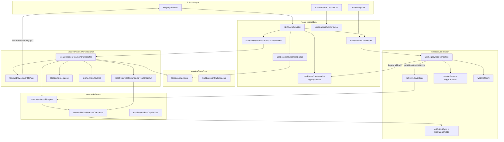

# Headset Integration in jssip-phone (Jabra & Plantronics/Poly)

**Source project:** `D:\Axata\JSSIP-PROJECTS\jssip-phone` or `C:\Users\User\Desktop\jssip-phone` 
**Document date:** 2026-07-09  
**Integration technology:** Web HID API (`navigator.hid`) — no Jabra SDK, no Plantronics Spokes/Poly Lens SDK

---

## Executive Summary

The `jssip-phone` project integrates USB headsets from **Jabra** (`vendorId: 0x0B0E`) and **Plantronics/Poly** (`vendorId: 0x047F`) exclusively through the browser/Electron **Web HID** API. Vendor-specific logic lives in HID report parsers and LED output profiles. All call-session coordination is vendor-agnostic and handled by four cooperating modules:

| Module | Responsibility |
|--------|----------------|
| `sessionStateCore` | Vendor-agnostic call session store (reducer + snapshot selectors) |
| `headsetConnection` | Web HID transport: connect, parse input reports, send LED output |
| `headsetAdapters` | Normalized `HeadsetCommand` / `HeadsetEvent` contract |
| `sessionHeadsetOrchestrator` | Bidirectional sync between session store and headset adapter |

**Application entry point:** `HidPhoneProvider` in `src/features/webHid/context/HidDeviceContext.tsx`, wrapped around the app in `App.tsx`.

**Important:** `createJabraNativeAdapter` and `createPlantronicsNativeAdapter` exist but are **not used in production**. Runtime always uses `createNativeHidAdapter` over a shared event bus.

---

## High-Level Architecture



---

## Two Runtime Paths

| Condition | Path | Device actions routed to | LED sync |
|-----------|------|--------------------------|----------|
| `backend === 'legacy-hid'` and device connected | **Orchestrator path (production)** | `publishNativeHidAction` → `nativeHidAdapter` → orchestrator | `resolveDeviceCommandsFromSnapshot` → sync queue |
| Otherwise | **Legacy fallback path** | `usePhoneCommands.dispatchAction` | `useHidLedSync` + inline LED in `dispatchHeadsetHookAction` |

`HidPhoneProvider` switches `legacyActionRef` based on `connection.backend`:

```typescript
legacyActionRef.current = isOrchestratorEnabled
  ? publishNativeHidAction
  : dispatchAction;
```

---

## Layer 1: Application Entry (`HidPhoneProvider`)

**File:** `src/features/webHid/context/HidDeviceContext.tsx`

### Responsibilities

1. Creates a `SessionStateStore` instance (`createSessionStateStore()`).
2. Wires `useHeadsetConnection` for USB connect/disconnect lifecycle.
3. Mirrors SIP call maps into the store via `useSessionStateStoreBridge`.
4. Starts the orchestrator via `useNativeHeadsetOrchestratorRuntime` when `backend === 'legacy-hid'`.
5. Exposes connection API through `HidDeviceContext` (connect, disconnect, enabled, auto-reconnect).

### Key dependencies from `DisplayProvider`

- `activeCalls`, `incomingCalls` — SIP session maps
- `handleAnswer`, `handleHangup`, `onToggleHoldHandler`, `updateCall`
- `isDND` — Do Not Disturb flag

### Startup sequence

```
App mount
  → HidPhoneProvider creates sessionStoreRef
  → resolveHidConfig(username) sets enabled + autoReconnect
  → useSessionStateStoreBridge mirrors activeCalls/incomingCalls → store
  → if legacy-hid connected:
       publishNativeHidAction replaces dispatchAction
       useNativeHeadsetOrchestratorRuntime starts orchestrator
```

---

## Layer 2: Web HID Transport (`headsetConnection`)

### 2.1 `useHeadsetConnection`

**File:** `src/modules/headsetConnection/hooks/useHeadsetConnection.ts`

Public API of the headset connection module. Composes:

- `useHeadsetDeviceRouting` — device picker, auto-reconnect, USB failover
- `useLegacyHidConnection` — open/close device, parse reports, USB events

**Connection states:** `unsupported` | `disconnected` | `connecting` | `connected` | `error`

**Backend:** always `'legacy-hid'` when a device is connected (Jabra SDK path was removed).

### 2.2 `useHeadsetDeviceRouting`

**File:** `src/modules/headsetConnection/hooks/useHeadsetDeviceRouting.ts`

| Function | What it does |
|----------|--------------|
| `connectDevice()` | Opens browser HID picker (`requestHidDevice`), sets `backend: 'legacy-hid'`, calls `attachDevice` |
| `disconnectDevice()` | Detaches device, clears backend |
| `tryAutoReconnect()` | Picks first granted device on startup |
| `handleActiveDeviceUsbRemoved(exclude)` | On USB unplug: detach → `pickNextGrantedDevice` → reconnect or `disconnected` |

**USB failover scenarios:**

| Scenario | Result |
|----------|--------|
| 2 USB headsets, active unplugged | Failover to second granted device |
| 2 USB, non-active unplugged | No change |
| 1 USB unplugged | `disconnected` |
| User cancels picker | `disconnected` |
| Manual disconnect | No failover |
| Second USB plugged while one connected | Ignored |

### 2.3 `useLegacyHidConnection`

**File:** `src/modules/headsetConnection/hooks/useLegacyHidConnection.ts`

Core transport hook. Key functions:

#### `attachDevice(targetDevice)`

```
openHidDevice(targetDevice)
  → resolveParser(targetDevice)          // vendor-specific parser
  → createEdgeDetector(parser.supportsHold)
  → performTelephonyHandshake(targetDevice)  // idle LED activates telephony reporting
  → onDeviceChange(targetDevice)
  → connectionState = 'connected'
```

#### Input report handler (subscribed via `subscribeInputReports`)

```
inputreport event
  → parser.parseUpdate(reportId, data)   // vendor-specific byte parsing
  → if first report:
       edgeDetector.syncState(update)     // no false edges
       if Jabra && hookSwitch=true:
         emit synthetic { type: 'hook', state: 'off' }  // answer if already off-hook
       return
  → edgeDetector.detect(update)          // edge detection (transitions only)
  → onLegacyDeviceAction(action)         // → publishNativeHidAction or dispatchAction
```

#### USB connect/disconnect

- `subscribeHidConnectEvents` — auto-reconnect on plug if `autoReconnect` enabled
- On disconnect of active device → `detachDevice` → `onActiveDeviceUsbRemoved`

### 2.4 `webHidClient`

**File:** `src/modules/headsetConnection/core/webHidClient.ts`

Thin wrapper over `navigator.hid`:

| Export | Purpose |
|--------|---------|
| `requestHidDevice()` | Browser device picker with `HID_DEVICE_FILTERS` |
| `getGrantedHidDevices()` | Previously authorized devices |
| `openHidDevice()` / `closeHidDevice()` | Open/close HID connection |
| `subscribeInputReports()` | Listen to `inputreport` events |
| `subscribeHidConnectEvents()` | Listen to `connect` / `disconnect` |

**Device filters** (`constants.ts`):

```typescript
{ vendorId: 0x0B0E, usagePage: 0x0B }  // Jabra telephony
{ vendorId: 0x047F, usagePage: 0x0B }  // Plantronics telephony
```

### 2.5 `performTelephonyHandshake`

**File:** `src/modules/headsetConnection/core/telephonyHandshake.ts`

Sends idle LED state on connect — this **activates telephony input reporting** on Jabra and Poly headsets:

```
resetLedOutputBlock(device)
sendLedState({ mute: false, offHook: false, ringing: false })
```

### 2.6 `nativeHidEventBus`

**File:** `src/modules/headsetConnection/core/nativeHidEventBus.ts`

Single pub/sub bus decoupling transport from orchestrator:

| Function | Role |
|----------|------|
| `publishNativeHidAction(action)` | Called from `useLegacyHidConnection` when orchestrator enabled |
| `subscribeNativeHidActions(listener)` | Called by `createNativeHidAdapter.connect()` |

Ensures **one** input report listener in transport; orchestrator reads through adapter.

### 2.7 Edge detector

**File:** `src/modules/headsetConnection/core/parsers/createEdgeDetector.ts`

Detects **transitions**, not levels:

| Input change | Output action |
|--------------|---------------|
| `hookSwitch` edge | `{ type: 'hook', state: 'off' \| 'on' }` |
| `phoneMute` edge | `{ type: 'mute', state: 'muted' \| 'unmuted' }` |
| `flash` / `programmable` press (only if `supportsHold`) | `{ type: 'hold' }` |

For Jabra and Plantronics parsers: **`supportsHold: false`** — hold button from headset is not supported.

---

## Layer 3: Vendor-Specific Parsers

**Resolver:** `src/modules/headsetConnection/core/parsers/resolveParser.ts`

```
vendorId 0x0B0E + HSC016 product → jabraHsc016Parser
vendorId 0x047F + BW3320 product → plantronicsBw3320Parser
vendorId 0x0B0E                  → jabraParser
vendorId 0x047F                  → plantronicsParser
else                             → genericTelephonyParser
```

### 3.1 Jabra — Generic (`jabraParser.ts`)

**Products:** all Jabra except HSC016 Evolve 20 family  
**`supportsHold`:** `false`

| Report ID | Parsing |
|-----------|---------|
| 1 | Ignored (volume) |
| 2 | byte0: bit0 = hook, bit2 (`0x04`) = mute |
| 3 | byte0 bit3 (`0x08`) = legacy mute |
| default | Standard HID telephony byte |

### 3.2 Jabra — Evolve 20 HSC016 (`jabraHsc016Parser.ts`)

**Products:** `0x0300`, `0x0301`, `0x0302`, `0x0303`  
**`supportsHold`:** `false`

| Report ID | Parsing |
|-----------|---------|
| 1 | Ignored (volume) |
| 2 | Telephony byte with special semantics (see below) |
| 3 | Legacy mute bit `0x08` |

**Report 2 byte0 semantics:**

| Value | Meaning |
|-------|---------|
| `0x01` | Off-hook / hook pressed (answer) |
| `0x02` | On-hook / hook released (hangup) |
| `0x04` | Mute bit in combined state |
| `0x07` | Mute pressed — hook bits are noise, **not** a real hook transition |
| `0x03` | Mute released — same, no hook transition |
| `0x00` | On-hook idle |

**Jabra-specific init behavior** (`useLegacyHidConnection`): on first report, if `parser.vendor === 'jabra'` and `hookSwitch === true`, emits synthetic `hook: off` to answer an already off-hook headset.

### 3.3 Plantronics — Generic (`plantronicsParser.ts`)

**Products:** all Plantronics/Poly except BW3320  
**`supportsHold`:** `false`

| Report ID | Parsing |
|-----------|---------|
| 1 (default) | Standard HID telephony byte: bit0 = hook, bit1 = mute |

### 3.4 Plantronics — Blackwire 3320 (`plantronicsBw3320Parser.ts`)

**Products:** `0x430a`, `0xc056`  
**`supportsHold`:** `false`

| Report ID | Parsing |
|-----------|---------|
| 11 | byte0: bit0 (`0x01`) = hook/off-hook, bit2 (`0x04`) = phone mute |

---

## Layer 4: LED Output (App → Device)

### 4.1 `ledOutputSync`

**File:** `src/modules/headsetConnection/core/ledOutputSync.ts`

| Function | LED state sent |
|----------|----------------|
| `syncLedIncomingRing` | `{ ringing: true, offHook: false, mute: false }` |
| `syncLedAfterAnswer` / `signalOutgoing` | `{ offHook: true, ringing: false, mute: false }` |
| `syncLedAfterHangup` / `clearOutgoingSignal` | `{ offHook: false, ringing: false, mute: false }` |
| `syncLedOnHold` | `{ ringing: true, offHook: false }` — hold ring pattern; green press = hookOff → resume |
| `syncLedMute` | `{ mute: isMuted, offHook: true }` |

**Error handling:** `NotAllowedError` on `sendReport` → device added to block list; SIP controls still work, LED sync disabled for that device.

### 4.2 `ledOutputProfile` — Vendor LED encoding

**File:** `src/modules/headsetConnection/core/ledOutputProfile.ts`

#### Jabra Evolve LED profile (`jabraEvolveLedProfile`)

Used for HSC016 product IDs and device names containing `"evolve"`.

- **Report ID:** `2`
- **Payload:** `[bits, 0x00]`
- **Bits:** bit0 off-hook, bit1 mute-led, bit2 ring-led, bit4 microphone-led, bit5 ringer

#### Poly BW3320 LED profile (`polyBw3320LedProfile`)

Sends **three separate output reports** (unlike generic single-report):

| Report ID | LED |
|-----------|-----|
| 9 | Mute LED |
| 23 | Off-hook LED |
| 24 | Ring LED |

Each report: `Uint8Array([active ? 1 : 0])`.

#### Generic / other Plantronics

`createStandardLedProfile` — discovers LED report ID from HID collections (usage page `0x08`), encodes single byte with bits: mute=`0x01`, offHook=`0x02`, ring=`0x04`.

---

## Layer 5: Headset Adapters (`headsetAdapters`)

### 5.1 Contract (`contracts.ts`)

**Commands (app → device):**

| Type | LED effect via `executeNativeHeadsetCommand` |
|------|---------------------------------------------|
| `signalIncoming` | `syncLedIncomingRing` |
| `signalOutgoing` | `syncLedAfterAnswer` |
| `answer` | `syncLedAfterAnswer` |
| `reject` / `hangup` / `clearOutgoingSignal` | `syncLedAfterHangup` |
| `toggleHold` | `syncLedOnHold` |
| `setMute` | `syncLedMute` |

**Events (device → app):**

| Type | Fields |
|------|--------|
| `hook` | `state: 'off' \| 'on'` |
| `muteChanged` | `muted: boolean` |
| `holdChanged` | `held: boolean` |
| `ringingChanged` | reserved |
| `deviceError` | transport errors |

### 5.2 Production adapter: `createNativeHidAdapter`

**File:** `src/modules/headsetAdapters/nativeHidAdapter.ts`

| Method | Implementation |
|--------|----------------|
| `connect()` | `subscribeNativeHidActions` → map `HeadsetDeviceAction` → `HeadsetEvent` → emit |
| `disconnect()` | Unsubscribe bus |
| `send(command)` | `executeNativeHeadsetCommand(getDevice(), command)` |
| `getCapabilities()` | `resolveHeadsetCapabilities(device)` |
| `subscribe(listener)` | Internal event emitter |

**Resolver:** `resolveNativeHeadsetAdapter` always returns `createNativeHidAdapter` regardless of vendor.

### 5.3 Capabilities (`resolveHeadsetCapabilities`)

**File:** `src/modules/headsetAdapters/resolveHeadsetCapabilities.ts`

For both Jabra and Plantronics:

| Capability | Value |
|------------|-------|
| `supportsAnswer` | `true` |
| `supportsReject` | `true` |
| `supportsHangup` | `true` |
| `supportsHold` | `parser.supportsHold` → **`false`** for Jabra/Plantronics |
| `supportsMute` | `true` |
| `supportsOutgoingSignal` | `true` |
| `supportsIncomingSignal` | `true` |
| `supportsRejectOnHookOn` | `true` for Jabra and Plantronics |

**Reject on hook-on:** when incoming call is waiting and there is no active conversation, pressing hook **on** (placing on hook) triggers `onReject` instead of hangup.

### 5.4 Unused vendor adapters (reference only)

| Adapter | File | Status |
|---------|------|--------|
| `createJabraNativeAdapter` | `jabraNativeAdapter.ts` | Direct HID listener; `send()` no-op; not in runtime |
| `createPlantronicsNativeAdapter` | `plantronicsNativeAdapter.ts` | Same; not in runtime |

`JABRA_APP_ID`, `JABRA_PARTNER_KEY` in `config.ts` and `.env.example` are declared but **never imported** — placeholder for future SDK integration.

---

## Layer 6: Session State Store (`sessionStateCore`)

Vendor-agnostic immutable call state. No SIP or HID dependencies inside the module.

### Store events

| Event | Purpose |
|-------|---------|
| `session_upsert` | Patch single session |
| `session_remove` | Remove session by id |
| `session_replace_all` | Full snapshot replace (used by SIP bridge) |
| `session_tag` | Add meta tag |

### `SessionCallSnapshot` (orchestrator input)

Flattened view built by `buildSessionCallSnapshot()`:

| Field | Meaning |
|-------|---------|
| `establishedCount` | Number of established sessions |
| `activeSessionId` | Active (not on hold) established call |
| `heldSessionIds` | Established calls on hold |
| `outgoingInProgressIds` | Outgoing calls dialing |
| `incomingWaitingCount` | Waiting incoming calls |
| `activeIsMuted` / `activeIsOnHold` | Flags of active session |

### SIP bridge (`useSessionStateStoreBridge`)

**File:** `src/features/webHid/context/useSessionStateStoreBridge.ts`

| Trigger | Store action |
|---------|--------------|
| `activeCalls` / `incomingCalls` change | `session_replace_all` (source: `sip`) |
| `subscribeSipCallStateChanged` | Re-sync from refs (source: `ui`) |
| `subscribeOutgoingInitiated` | Upsert pseudo-session `outgoing-ui-pending` |
| `subscribeOutgoingEnded` | Remove `outgoing-ui-pending` |

The pseudo-session `outgoing-ui-pending` tracks UI-only outgoing dial state before SIP session exists.

---

## Layer 7: Session Headset Orchestrator

**Core file:** `src/modules/sessionHeadsetOrchestrator/orchestrator.ts`  
**Runtime wiring:** `src/features/webHid/context/useNativeHeadsetOrchestratorRuntime.ts`

### 7.1 `createSessionHeadsetOrchestrator`

Creates bidirectional sync between `SessionStateStore` and `IHeadsetAdapter`.

#### On `start()`:

1. `adapter.connect()` — subscribe to event bus
2. Build initial snapshot → `resolveInitialConnectCommands` → enqueue LED sync
3. Subscribe to store changes → `reconcileToDevice`
4. Subscribe to adapter events → `forwardDeviceEventToApp`

#### `reconcileToDevice(nextSnapshot)` — App → Device

```
commands = resolveDeviceCommandsFromSnapshot(lastSnapshot, next)
if incoming-signal-only OR guards allow:
  lastSnapshot = next
  queue.enqueue(() => adapter.send(each command))
```

#### Adapter event handler — Device → App

```
if hold/mute sync guard active → ignore (except hook during hold guard check)
guards.markDeviceToAppSync()
forwardDeviceEventToApp(event, snapshot, incomingSessionId, callbacks, guards)
```

### 7.2 SIP callbacks (`useNativeHeadsetOrchestratorRuntime`)

| Callback | SIP action |
|----------|------------|
| `onAnswer(sessionId?)` | Hold all other established sessions → `handleAnswer(sessionId)` |
| `onReject(sessionId)` | `resolveHeadsetHangup` → `handleHangup` or `notifyOutgoingEnded` |
| `onHangup(sessionId)` | Same as reject |
| `onToggleHold(sessionId)` | `onToggleHoldHandler(sessionId)` |
| `onSetMute(sessionId, muted)` | `applySessionMute(session)` + `updateCall(session)` |
| `isDnd()` | Blocks answer on incoming |

### 7.3 `forwardDeviceEventToApp` — Device button mapping

**File:** `src/modules/sessionHeadsetOrchestrator/forwardDeviceEventToApp.ts`

#### Hook OFF (`state: 'off'`)

| Snapshot condition | Action |
|--------------------|--------|
| Incoming waiting, not DND | `onAnswer(incomingSessionId)`; set hookGuard 600ms; if call-waiting (active conversation exists) set acceptGuard 1500ms |
| Outgoing dialing | Ignore |
| All held, no active | `onToggleHold(heldId)` resume; hookGuard 600ms |

#### Hook ON (`state: 'on'`)

| Snapshot condition | Action |
|--------------------|--------|
| Outgoing dialing | `onHangup(outgoingId)` |
| Within hookGuard window (600ms) | Ignore — suppress bounce after answer |
| Within acceptGuard window (1500ms) | Ignore — suppress bounce after call-waiting answer |
| Incoming waiting, no active conversation | **`onReject(incomingSessionId)`** — reject-on-hook-on |
| Incoming + active conversation (call waiting) | Ignore hook-on |
| Otherwise | `onHangup(resolveHangupTargetId(snapshot))` |

#### `resolveHangupTargetId`

**File:** `src/modules/sessionStateCore/resolveHangupTargetId.ts`

Priority: `activeSessionId` → first `outgoingInProgressId` → `undefined` if all established are held (does not drop held-only calls).

#### Mute changed

Only when `event.muted === true`, active session exists, mute guard inactive:
→ toggle mute: `onSetMute(activeId, !snapshot.activeIsMuted)`

#### Hold changed

Only when `snapshot.activeSessionId` exists:
→ `onToggleHold(activeSessionId)`

### 7.4 `resolveDeviceCommandsFromSnapshot` — App state → LED commands

**File:** `src/modules/sessionHeadsetOrchestrator/policies/reconcileDeviceState.ts`

Compares previous and next `SessionCallSnapshot`:

| Condition | Commands |
|-----------|----------|
| Incoming appeared or count increased | `signalIncoming` |
| Incoming still waiting | **Stop** — only incoming signal sent |
| Incoming cleared, no calls | `clearOutgoingSignal` |
| Incoming cleared, established | `answer` or `toggleHold` (if all on hold) |
| Outgoing dial started | `signalOutgoing` |
| Outgoing dial ended | `answer` / `toggleHold` / `clearOutgoingSignal` |
| Established count increased | `answer` |
| Hold/active session changed | `toggleHold` or `answer` |
| Mute changed on active (not on hold) | `setMute` |
| All calls ended | `hangup` |
| Outgoing dialing active | `toggleHold` commands filtered out |

#### `resolveInitialConnectCommands` (on orchestrator start)

Priority: incoming → outgoing dial → hold → active+mute → idle (`clearOutgoingSignal`).

### 7.5 Guards and sync queue

#### `OrchestratorGuards` (`guards.ts`)

300ms window preventing reconcile loops:
- `markAppToDeviceSync` — blocks device→app processing echo
- `markDeviceToAppSync` — blocks app→device reconcile echo

#### `HeadsetSyncQueue` (`syncQueue.ts`)

| Guard / constant | Duration | Purpose |
|------------------|----------|---------|
| Hold sync guard | 2000 ms | Ignore device events during hold sync |
| Mute sync guard | 600 ms | Ignore mute echo during mute sync |
| hookGuard | 600 ms | Suppress hook-on after hook-off |
| acceptGuard | 1500 ms | Suppress hook-on after call-waiting answer |

FIFO serialization of `adapter.send` batches via `enqueue(task)`.

### 7.6 UI sync integration (`useHeadsetCallController`)

**File:** `src/features/headsetController/hooks/useHeadsetCallController.ts`

When `backend === 'legacy-hid'` and connected:

- Subscribes to sync queue state via `nativeHeadsetSyncBridge`
- Blocks hold/mute UI actions while sync in progress for that session
- `toggleHold` / `toggleMute` call `beginHoldSessionSync` / `beginMuteSessionSync` before SIP handlers

Used in: `ControlPanel`, `ActiveCall`, `Display`, `IncomingCallModal`.

---

## Layer 8: Legacy Fallback Path

When orchestrator is disabled (`backend !== 'legacy-hid'`):

### `usePhoneCommands` → `dispatchAction`

**File:** `src/features/webHid/hooks/usePhoneCommands.ts`

- 250ms debounce per action type
- Requires `isRegistered`
- Hook → `dispatchHeadsetHookAction` (inline LED sync)
- Mute → toggle mute on active session + `syncLedMute`
- Hold → `onToggleHoldHandler` (only if `supportsHold` from parser — not for Jabra/Plantronics)

### `dispatchHeadsetHookAction`

**File:** `src/features/webHid/hooks/dispatchHeadsetHookAction.ts`

Simpler hook logic without orchestrator guards (except 600ms incoming hook-release guard for Jabra bounce).

### `useHidLedSync`

**File:** `src/features/webHid/hooks/useHidLedSync.ts`

Reactive LED sync on SIP state changes (without orchestrator snapshot diffing).

---

## End-to-End Call Flows

### Flow A: Incoming call — answer from headset

```
SIP INVITE → incomingCalls updated
  → useSessionStateStoreBridge → store (incomingWaitingCount++)
  → orchestrator reconcileToDevice → signalIncoming
  → syncLedIncomingRing → Jabra/Poly ring LED on

User presses hook (off-hook) on headset
  → HID inputreport → jabraHsc016Parser / plantronicsParser
  → edgeDetector → { type: 'hook', state: 'off' }
  → publishNativeHidAction → nativeHidAdapter → HeadsetEvent
  → forwardDeviceEventToApp → onAnswer(incomingSessionId)
  → useNativeHeadsetOrchestratorRuntime:
       hold other established sessions
       handleAnswer(sessionId)
  → store updated (established, active)
  → reconcileToDevice → answer + setMute(if needed)
  → syncLedAfterAnswer
```

### Flow B: Incoming call — reject from headset (hook-on)

```
Incoming waiting, no active conversation
User places hook on (on-hook)
  → { type: 'hook', state: 'on' }
  → forwardDeviceEventToApp → onReject(incomingSessionId)
  → handleHangup(sessionId)
  → store: incoming cleared
  → reconcileToDevice → clearOutgoingSignal / hangup LED
```

### Flow C: Active call — hangup from headset

```
Active established session
User presses hook on
  → hookGuard / acceptGuard checks pass
  → resolveHangupTargetId → activeSessionId
  → onHangup(activeSessionId) → handleHangup
  → store: session removed
  → reconcileToDevice → hangup → syncLedAfterHangup
```

### Flow D: Mute from headset

```
Active call, user presses mute on headset
  → { type: 'mute', state: 'muted' }
  → forwardDeviceEventToApp (only if event.muted && !muteGuard)
  → beginMuteSessionSync → onSetMute(activeId, !activeIsMuted)
  → applySessionMute + updateCall
  → store: activeIsMuted toggled
  → reconcileToDevice → setMute → syncLedMute
```

### Flow E: Call waiting — answer second incoming

```
Active conversation + incoming waiting
User presses hook off
  → forwardDeviceEventToApp: hasIncoming && hasActiveConversation
  → onAnswer(incomingSessionId)
  → acceptGuard = 1500ms (longer than normal 600ms hookGuard)
  → other established sessions put on hold (in onAnswer callback)
```

### Flow F: Resume held call from headset

```
All established on hold, no active session
User presses hook off
  → forwardDeviceEventToApp → onToggleHold(heldId) resume
  → hookGuard 600ms
```

### Flow G: Outgoing call

```
UI initiates dial → outgoing-ui-pending in store
  → reconcileToDevice → signalOutgoing → off-hook LED

SIP connects → established
  → reconcileToDevice → answer LED

User cancels during dial (hook on)
  → forwardDeviceEventToApp → onHangup(outgoingId)
```

### Flow H: Device connect with active calls

```
User connects headset while call in progress
  → orchestrator.start()
  → resolveInitialConnectCommands(snapshot):
       incoming waiting → signalIncoming
       outgoing dialing → signalOutgoing
       all on hold → toggleHold
       active call → answer + setMute
       idle → clearOutgoingSignal
```

---

## Function Reference Map

### Connection lifecycle

| Function | File | Called by | Calls |
|----------|------|-----------|-------|
| `HidPhoneProvider` | `HidDeviceContext.tsx` | `App.tsx` | `useHeadsetConnection`, bridges, orchestrator |
| `useHeadsetConnection` | `useHeadsetConnection.ts` | `HidPhoneProvider` | `useHeadsetDeviceRouting`, `useLegacyHidConnection` |
| `connectDevice` | `useHeadsetDeviceRouting.ts` | Settings UI | `requestHidDevice`, `attachDevice` |
| `attachDevice` | `useLegacyHidConnection.ts` | routing | `openHidDevice`, `resolveParser`, `performTelephonyHandshake` |
| `performTelephonyHandshake` | `telephonyHandshake.ts` | `attachDevice` | `sendLedState` (idle) |

### Input path (device → app)

| Function | File | Called by | Calls |
|----------|------|-----------|-------|
| `subscribeInputReports` handler | `useLegacyHidConnection.ts` | HID event | `parser.parseUpdate`, `edgeDetector.detect` |
| `resolveParser` | `resolveParser.ts` | attach, capabilities | vendor parsers |
| `jabraHsc016Parser.parseUpdate` | `jabraHsc016Parser.ts` | resolveParser | byte parsing |
| `plantronicsBw3320Parser.parseUpdate` | `plantronicsBw3320Parser.ts` | resolveParser | byte parsing |
| `publishNativeHidAction` | `nativeHidEventBus.ts` | legacy hook | bus listeners |
| `createNativeHidAdapter.connect` | `nativeHidAdapter.ts` | orchestrator.start | `subscribeNativeHidActions` |
| `mapActionToEvent` | `nativeHidAdapter.ts` | bus listener | emit `HeadsetEvent` |
| `forwardDeviceEventToApp` | `forwardDeviceEventToApp.ts` | orchestrator | SIP callbacks |

### Output path (app → device)

| Function | File | Called by | Calls |
|----------|------|-----------|-------|
| `reconcileToDevice` | `orchestrator.ts` | store subscribe | `resolveDeviceCommandsFromSnapshot`, `queue.enqueue` |
| `resolveDeviceCommandsFromSnapshot` | `reconcileDeviceState.ts` | reconcileToDevice | returns `HeadsetCommand[]` |
| `adapter.send` | `nativeHidAdapter.ts` | queue task | `executeNativeHeadsetCommand` |
| `executeNativeHeadsetCommand` | `nativeHeadsetCommands.ts` | adapter.send | `syncLed*` functions |
| `sendLedState` | `ledOutputSync.ts` | syncLed* | `resolveLedOutputProfile`, `device.sendReport` |
| `resolveLedOutputProfile` | `ledOutputProfile.ts` | sendLedState | Jabra Evolve / Poly BW3320 / standard |

### Session state

| Function | File | Called by | Calls |
|----------|------|-----------|-------|
| `useSessionStateStoreBridge` | `useSessionStateStoreBridge.ts` | `HidPhoneProvider` | `store.dispatch` |
| `mapSipSessionsToStateEntries` | `sessionStateCore` | bridge | RTCSession → entries |
| `buildSessionCallSnapshot` | `sessionStateCore` | orchestrator | flat snapshot |
| `resolveHangupTargetId` | `resolveHangupTargetId.ts` | forwardDeviceEventToApp | hangup target |

---

## Electron-Specific Notes

**File:** `js-sip-electron/electron/main.ts`

Electron main process configures HID permissions:
- Allow `hid` permission requests
- `select-hid-device` handler for device selection

No Node-native HID (`node-hid`) — renderer Web HID only.

---

## File Map (canonical `src/` paths)

```
src/features/webHid/context/
  HidDeviceContext.tsx              # App entry point
  useSessionStateStoreBridge.ts     # SIP → store bridge
  useNativeHeadsetOrchestratorRuntime.ts  # Orchestrator lifecycle

src/features/webHid/hooks/
  usePhoneCommands.ts               # Legacy fallback
  dispatchHeadsetHookAction.ts      # Legacy hook handler
  useHidLedSync.ts                  # Legacy LED sync

src/features/headsetController/
  hooks/useHeadsetCallController.ts
  services/nativeHeadsetSyncBridge.ts
  services/headsetSyncSession.ts
  services/headsetBusyState.ts

src/modules/headsetConnection/
  hooks/useHeadsetConnection.ts
  hooks/useLegacyHidConnection.ts
  hooks/useHeadsetDeviceRouting.ts
  core/webHidClient.ts
  core/nativeHidEventBus.ts
  core/ledOutputSync.ts
  core/ledOutputProfile.ts
  core/telephonyHandshake.ts
  core/parsers/
    resolveParser.ts
    jabraParser.ts
    jabraHsc016Parser.ts
    plantronicsParser.ts
    plantronicsBw3320Parser.ts
    createEdgeDetector.ts
  constants.ts

src/modules/headsetAdapters/
  contracts.ts
  nativeHidAdapter.ts
  nativeHeadsetCommands.ts
  resolveNativeHeadsetAdapter.ts
  resolveHeadsetCapabilities.ts
  jabraNativeAdapter.ts             # unused in production
  plantronicsNativeAdapter.ts       # unused in production

src/modules/sessionHeadsetOrchestrator/
  orchestrator.ts
  forwardDeviceEventToApp.ts
  policies/reconcileDeviceState.ts
  syncQueue.ts
  guards.ts

src/modules/sessionStateCore/
  store.ts, reducer.ts, selectors.ts
  sipSnapshotAdapter.ts, sipSnapshotSelectors.ts
  resolveHangupTargetId.ts

docs/webHID-connection/
  en.md, ru.md                      # In-repo architecture docs
```

Duplicate tree exists at `js-sip-electron/src/` (mirror of above).

---

## Реализованные кейсы интеграции

Ниже перечислены все кейсы, реализованные в `jssip-phone` для интеграции с гарнитурами Jabra и Plantronics/Poly.

### Подключение и инфраструктура

1. **Подключение USB-гарнитуры через Web HID** — выбор устройства в системном picker (`requestHidDevice`), фильтр по vendor Jabra (`0x0B0E`) и Plantronics (`0x047F`) с usage page телефонии (`0x0B`).
2. **Автопереподключение при старте** — если ранее выдано разрешение, первое granted-устройство подключается автоматически (`autoReconnect`).
3. **Автопереподключение при USB plug** — при физическом подключении USB-гарнитуры, если нет активного устройства.
4. **USB failover** — при отключении активной гарнитуры автоматический переход на другое granted-устройство (если есть).
5. **Ручное отключение** — без попытки failover.
6. **Telephony handshake** — отправка idle LED при connect для активации telephony reporting на Jabra/Poly.
7. **Обработка отсутствия Web HID** — состояние `unsupported`, если `navigator.hid` недоступен.
8. **Обработка ошибок подключения** — состояние `error`, структурированное логирование (`logHeadsetConnectionError`).
9. **Блокировка LED output** — при `NotAllowedError` SIP-управление продолжает работать, синхронизация LED отключается для устройства.
10. **Настройки HID в UI** — включение/выключение интеграции, auto-reconnect, ручной connect/disconnect (`HidSettings`).
11. **Per-user конфигурация** — `resolveHidConfig(username)` задаёт enabled и autoReconnect.
12. **Аудит действий пользователя** — логирование connect/disconnect и действий кнопок в `loggerDB`.
13. **HID debug mode** — `localStorage['hid-debug']` для логирования raw HID reports.

### Vendor-specific: Jabra

14. **Generic Jabra parser** — report 2 (hook bit0, mute bit2), report 3 (legacy mute bit3), fallback на стандартный telephony byte.
15. **Jabra Evolve 20 (HSC016) parser** — product IDs `0x0300–0x0303`; report 2 с семантикой off-hook (`0x01`), on-hook (`0x02`), mute (`0x04`, `0x07`, `0x03` без ложных hook-переходов).
16. **Jabra Evolve LED profile** — report 2, payload `[bits, 0x00]` с битами off-hook, mute, ring, microphone, ringer.
17. **Синтетический hook-off при init** — если при первом report Jabra уже off-hook, эмитируется `hook: off` (ответ на звонок).
18. **Подавление bounce hook-on после answer** — guard 600ms против ложного hangup после ответа (Jabra-специфичное поведение прошивки).

### Vendor-specific: Plantronics/Poly

19. **Generic Plantronics parser** — report 1, стандартный HID telephony byte (hook bit0, mute bit1).
20. **Poly Blackwire 3320 parser** — product IDs `0x430a`, `0xc056`; telephony на report 11 (hook bit0, mute bit2).
21. **Poly BW3320 LED profile** — три отдельных output report: 9 (mute), 23 (off-hook), 24 (ring).
22. **Generic Plantronics LED** — auto-discovery LED report ID из HID collections.

### Управление звонками с гарнитуры (device → app)

23. **Ответ на входящий** — hook off при ожидающем incoming → `onAnswer`.
24. **Отклонение входящего (reject on hook-on)** — hook on при incoming без активного разговора → `onReject` (Jabra и Plantronics).
25. **Завершение активного звонка** — hook on → `onHangup` по `resolveHangupTargetId`.
26. **Отмена исходящего набора** — hook on при outgoing dialing → `onHangup(outgoingId)`.
27. **Переключение mute** — кнопка mute на гарнитуре → toggle mute активной сессии.
28. **Resume held call** — hook off когда все established на hold и нет active → `onToggleHold` resume.
29. **Call waiting — ответ на второй входящий** — hook off при incoming + active conversation → answer с удержанием остальных established; acceptGuard 1500ms.
30. **DND блокирует answer** — hook off при incoming + DND → игнор.
31. **Игнор hook off при outgoing dial** — предотвращение ложного answer во время набора.
32. **Игнор hook on при call waiting** — если есть active conversation и incoming, hook on не отклоняет второй звонок.
33. **Hangup не роняет held-only** — `resolveHangupTargetId` возвращает `undefined` если все established на hold.
34. **Hold с гарнитуры** — только если parser `supportsHold: true` (для Jabra/Plantronics **не реализовано**, `supportsHold: false`).

### Синхронизация состояния (app → device)

35. **LED входящего звонка** — `signalIncoming` → ring LED.
36. **LED исходящего набора** — `signalOutgoing` → off-hook LED.
37. **LED после ответа** — `answer` → off-hook LED.
38. **LED после завершения** — `hangup` / `clearOutgoingSignal` → idle LED.
39. **LED hold** — `toggleHold` → ring pattern (индикатор удержания).
40. **LED mute** — `setMute` → mute LED с учётом off-hook состояния.
41. **Синхронизация при connect** — `resolveInitialConnectCommands` выравнивает LED с текущим snapshot звонков.
42. **Приоритет incoming signal** — пока есть waiting incoming, другие LED-команды не отправляются (кроме `signalIncoming`).
43. **Фильтрация hold при outgoing dial** — `toggleHold` не отправляется во время исходящего набора.

### Синхронизация сессий и anti-echo

44. **Центральный session store** — vendor-agnostic reducer с lifecycle, mute, hold, incoming/outgoing flags.
45. **SIP bridge** — зеркалирование `activeCalls`/`incomingCalls` в store при каждом изменении.
46. **UI outgoing pseudo-session** — `outgoing-ui-pending` для UI-only состояния набора до появления SIP session.
47. **Двунаправленный orchestrator** — store subscribe → LED; adapter subscribe → SIP callbacks.
48. **FIFO sync queue** — сериализация batch-ей LED-команд.
49. **Orchestrator guards (300ms)** — предотвращение петель app↔device sync.
50. **Hook guard (600ms)** — подавление hook-on после hook-off.
51. **Accept guard (1500ms)** — подавление hook-on после answer при call waiting.
52. **Hold sync guard (2000ms)** — игнор device events во время hold sync.
53. **Mute sync guard (600ms)** — игнор mute echo во время mute sync.
54. **UI blocking during sync** — `useHeadsetCallController` блокирует hold/mute в UI пока идёт sync с гарнитурой.
55. **UI-initiated hold/mute guards** — `beginHoldSessionSync` / `beginMuteSessionSync` при действиях из UI.
56. **Pending intent tracking** — queue отслеживает pending hold/mute intent до совпадения snapshot.
57. **Auto-hold при answer call waiting** — при ответе на второй звонок остальные established автоматически ставятся на hold.

### Legacy fallback path

58. **Прямая обработка без orchestrator** — `usePhoneCommands` с debounce 250ms когда orchestrator выключен.
59. **Inline LED sync в legacy path** — `dispatchHeadsetHookAction` + `useHidLedSync`.
60. **Legacy hook-release guard** — 600ms защита от bounce после answer в legacy path.

### Мульти-линейность

61. **Несколько established сессий** — snapshot отслеживает active, held, counts.
62. **Несколько incoming** — `incomingWaitingCount`, `selectFirstIncomingId` для первого в очереди.
63. **Увеличение incoming count** — повторный `signalIncoming` при новом входящем.

---

## Плюсы и минусы подхода

### Плюсы

1. **Отсутствие vendor SDK** — интеграция через стандартный Web HID не требует установки Jabra Direct, Poly Lens, Spokes или лицензирования partner keys. Работает в Chromium/Electron renderer без native addons.

2. **Единая архитектура для всех вендоров** — transport (`headsetConnection`), контракт (`headsetAdapters`), оркестратор (`sessionHeadsetOrchestrator`) и store (`sessionStateCore`) полностью vendor-agnostic. Vendor-специфика изолирована в парсерах и LED-профилях (~4 файла на вендор).

3. **Чёткое разделение слоёв** — SIP/UI не знают о HID bytes; HID transport не знает о SIP sessions. Оркестратор — единственная точка двунаправленной синхронизации. Это упрощает тестирование политик и миграцию в другой проект.

4. **Продуманная защита от эха и гонок** — многоуровневые guards (300ms orchestrator, 600ms hook, 1500ms call-waiting, 2000ms hold sync) решают реальные проблемы прошивок Jabra (bounce hook-on после answer) и петель app↔device sync.

5. **Нормализованный контракт команд/событий** — `HeadsetCommand` / `HeadsetEvent` позволяют в будущем подключить SDK-адаптер (Jabra, Poly) без изменения оркестратора — достаточно новой реализации `IHeadsetAdapter`.

6. **Session store как single source of truth** — плоский `SessionCallSnapshot` для политик оркестратора отделён от SIP `RTCSession`. Политики reconciliation читаются декларативно из snapshot diff.

7. **USB failover** — автоматическое переключение на другое granted-устройство при отключении активной гарнитуры.

8. **Graceful degradation** — при блокировке LED output (`NotAllowedError`) SIP-управление звонками продолжает работать; блокируется только синхронизация индикаторов.

9. **Документированность** — in-repo docs (`docs/webHID-connection/`), README в модулях, комментарии к протоколам (Jabra HSC016 byte semantics, BW3320 report IDs).

10. **UI sync awareness** — `useHeadsetCallController` предотвращает конфликт одновременных действий пользователя в UI и на гарнитуре во время hold/mute sync.

### Минусы

1. **Ограниченная поддержка моделей** — явно протестированы/закодированы только Jabra Evolve 20 (HSC016), generic Jabra, generic Plantronics и Poly Blackwire 3320. Другие модели могут иметь другие report IDs и потребуют новых парсеров/LED-профилей.

2. **Нет hold-кнопки с гарнитуры** — для Jabra и Plantronics `supportsHold: false`. Удержание звонка с кнопок гарнитуры не работает; только через UI или hook-off resume для held calls.

3. **Нет Bluetooth-специфики** — Web HID в основном для USB. BT-гарнитуры через Web HID имеют ограниченную поддержку в браузерах и не покрыты отдельной логикой.

4. **Дублирование кода** — полное зеркало `src/` в `js-sip-electron/src/`. Риск рассинхронизации при изменениях.

5. **Два runtime path** — orchestrator path и legacy fallback (`usePhoneCommands`) дублируют часть логики (hook mapping, LED sync). Legacy path проще, но менее полный (нет call-waiting guards, нет reject-on-hook-on в полном объёме).

6. **Мёртвый код** — `jabraNativeAdapter`, `plantronicsNativeAdapter`, `JABRA_APP_ID`/`JABRA_PARTNER_KEY`, дубликаты парсеров в `features/webHid/parsers/` не используются в production. Увеличивают когнитивную нагрузку.

7. **Сложность guards** — множество временных окон (300/600/1500/2000ms) трудно отлаживать. Неожиданное игнорирование hook events может восприниматься пользователем как «гарнитура не работает».

8. **Зависимость от Chromium Web HID** — поведение `sendReport`/`inputreport` зависит от версии Chromium/Electron. `NotAllowedError` на LED — известная проблема на части устройств/ОС.

9. **Нет Spokes/Poly Lens интеграции** — корпоративные функции Poly (firmware update, device management, расширенные кнопки, Bluetooth через hub) недоступны. Только базовые telephony HID reports.

10. **Псевдо-сессия `outgoing-ui-pending`** — workaround для UI-only состояния набора добавляет сложность в snapshot и hangup resolution (`resolveHeadsetHangup`). Потенциальный источник edge-case багов.

11. **Минимальное автотестирование интеграции** — unit-тесты есть для `sessionStateCore` reducer/selectors, но нет тестов для парсеров, orchestrator policies, `forwardDeviceEventToApp`. Регрессии на реальных устройствах ловятся только вручную.

12. **Hold LED = ring pattern** — `syncLedOnHold` использует `ringing: true`, что может путать пользователя (мигающий ring LED при hold, а не отдельный hold-индикатор). Зависит от того, как конкретная гарнитура интерпретирует биты.

13. **Привязка к legacy softphone state model** — bridge напрямую читает `RTCSession` maps из `DisplayProvider`, а не абстрактный call engine. Перенос в новую архитектуру (как `softphone-electron`) потребует замены bridge, но не transport/orchestrator.

---

## Related In-Repo Documentation

- `D:\Axata\JSSIP-PROJECTS\jssip-phone\docs\webHID-connection\en.md`
- `D:\Axata\JSSIP-PROJECTS\jssip-phone\docs\webHID-connection\ru.md`
- `D:\Axata\JSSIP-PROJECTS\jssip-phone\src\modules\headsetAdapters\README.md`
- `D:\Axata\JSSIP-PROJECTS\jssip-phone\src\modules\sessionHeadsetOrchestrator\README.md`
