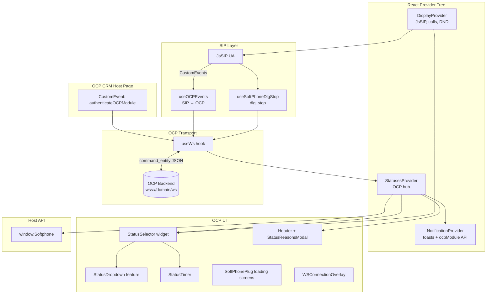
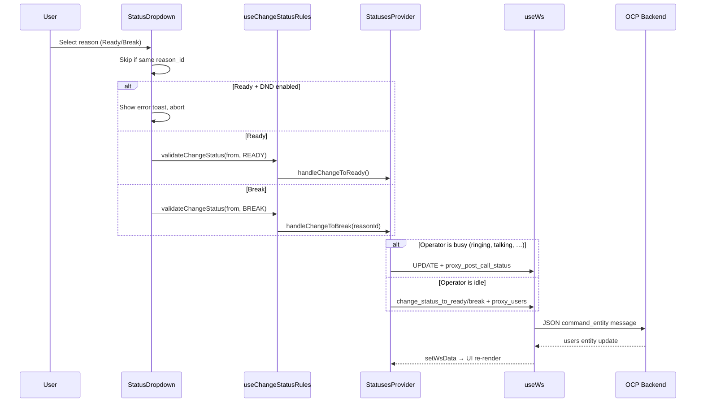
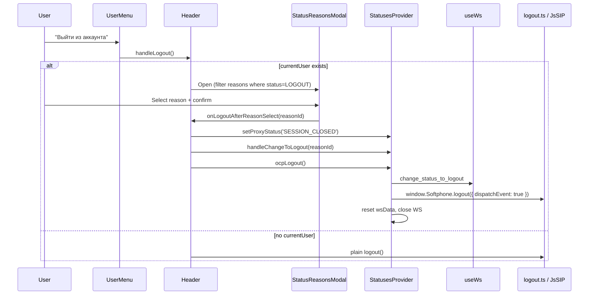

# OCP Module Integration in jssip-phone (AxaTalk Legacy)

**Source project:** `C:\Users\User\Desktop\jssip-phone`  
**Document date:** 2026-07-13  
**Integration technology:** OCP WebSocket (`wss://{domain}/ws`) — no REST/HTTP API for operator status  
**Build flag:** `REACT_APP_OCP_BUILD=true` enables the full OCP integration path

---

## Executive Summary

The OCP (Omnichannel Platform) module in `jssip-phone` is **not a standalone package**. It is a cross-cutting integration layer that:

1. Connects to the OCP backend over a dedicated WebSocket.
2. Manages the current operator's status (Ready, Break, system-driven states like Ringing/Talking).
3. Renders a status dropdown and a logout-with-reason modal.
4. Bridges SIP telephony events to OCP and vice versa via DOM `CustomEvent`s and `window.Softphone`.

There are **two independent WebSocket channels**:

| Channel | Purpose |
|---------|---------|
| OCP WS | Operator business state, credentials, campaigns, notifications |
| SIP WS (JsSIP) | Media and signaling |

The module works when embedded in an OCP CRM page that dispatches `authenticateOCPModule` with domain and auth token.

---

## High-Level Architecture



---

## Provider Tree and Layer Model

### React provider nesting

```
ThemeProvider
  └ DisplayProvider          ← JsSIP, calls, DND, SIP registration
       └ HidPhoneProvider
            └ StatusesProvider   ← OCP WebSocket, operator status (hub)
                 └ NotificationProvider
                      └ LoggerProvider (IndexedDB)
                           └ SoftPhone
```

### Actual layers (as implemented, not idealized)

| Layer | Implementation | Responsibility |
|-------|----------------|----------------|
| Host / CRM page | Dispatches `authenticateOCPModule` | Provides `ocpDomain` + `ocpAuthToken` |
| Integration bus | `window.Softphone` + DOM `CustomEvent`s | Cross-module and host-page communication |
| OCP transport | `useWs` hook | WebSocket connect, auth, reconnect, `sendMessage` |
| OCP state | `StatusesProvider` + `useState<WsData>` | Current user, reasons, creds, proxy status |
| Client business rules | `useChangeStatusRules`, `USER_STATUS_RULES`, `useDNDValidation` | Transition validation before WS send |
| Telephony | `DisplayProvider` + JsSIP | SIP sessions independent of OCP |
| UI | `widgets/` + `features/` | StatusSelector, Header, modals, overlays |

There is **no Domain/Application layer**. Business logic lives in providers and hooks.

---

## Core State Model

### Current operator

Always `wsData.users[0]` (`currentUser` in `StatusesProvider`):

```typescript
interface User {
  id: number;
  status: {
    value: number;      // canonical status (READY=1, BREAK=7, TALKING=4, …)
    reason_id: number;  // specific reason from operator_status_reasons
  };
  status_time: string;  // timestamp for StatusTimer
}
```

### Operator status reasons

`operator_status_reasons` is a flat list from OCP. Each entry has:

- `id` — reason identifier sent in WS payloads
- `status` — parent status value (READY, BREAK, LOGOUT, …)
- `default_description` — label shown in UI

The status dropdown shows only reasons where `status === READY` or `status === BREAK`. Logout reasons (`status === LOGOUT`) appear only in the logout modal.

### Status enum

| Value | Constant | Label (RU) |
|-------|----------|------------|
| 1 | READY | Доступен |
| 2 | RINGING | Звонок |
| 3 | RESERVED_TO_CALL | Зарезервирован для звонка |
| 4 | TALKING | Разговор |
| 5 | POST_CALL_PROCESSING | Поствызывная обработка |
| 6 | HOLD | Удержание вызова |
| 7 | BREAK | Перерыв |
| 8 | PREPARING_TO_WORK | Подготовка к работе |
| 9 | LOGOUT | Выход |
| 10–15 | AUTH, RECONNECTED, DISCONNECTED, NEW_USER, PRE_CALL_PROCESSING, CONNECTION | System states |

**Busy set** (`USER_STATUSES_BUSY`) — post-call routing applies: RINGING, RESERVED_TO_CALL, TALKING, POST_CALL_PROCESSING, HOLD, PRE_CALL_PROCESSING, CONNECTION.

---

## Status Change Flow

### User-initiated change (dropdown)



### Command routing (`StatusesProvider`)

| Operator state | Action | WS command | WS entity |
|----------------|--------|------------|-----------|
| Not busy | → Ready | `change_status_to_ready` | `proxy_users` |
| Not busy | → Break | `change_status_to_break` | `proxy_users` |
| Busy | → Ready/Break | `update` | `proxy_post_call_status` |
| Any (logout) | → Logout | `change_status_to_logout` | `proxy_users` |

Payload always includes `operator_id` and optionally `reason_id`. Internal UI changes set `function_call_type: 'internal'`; external API calls via `window.Softphone.ocpModule` set `'external'`.

### Client-side transition rules

`USER_STATUS_RULES` in `src/constants/ocpStatuses.ts` defines allowed transitions. `useChangeStatusRules.validateChangeStatus` checks the map and shows an error toast if the transition is illegal.

Example: from `READY` only `BREAK` and `LOGOUT` are allowed; from `POST_CALL_PROCESSING` also `READY` is allowed.

### Server-driven status

OCP can push `users` entity updates without UI action (e.g. auto-transition to RINGING, TALKING, POST_CALL_PROCESSING during calls). The dropdown does not expose these system statuses — they come from the server only.

### DND integration

- `DisplayProvider` toggles DND → dispatches `dndEvent` CustomEvent.
- `useDNDValidation` listens and calls `handleChangeToBreak(USER_STATUS.BREAK)` (reason id = 7).
- DND blocks manual Ready selection in the dropdown.

### External status API

`useStatusSelectorAPIAdapter` patches `window.Softphone.ocpModule`:

- `changeStatusToReady()` — only from `POST_CALL_PROCESSING`, respects DND.
- `changeStatusToBreak()` — any allowed transition; `isNativeChange=true` skips post-call routing.

---

## Logout with Reason Flow



### Cascading logout

`logout.ts` dispatches `softphoneLogoutEvent`. `StatusesProvider` listens and may send another `change_status_to_logout` if needed, then resets state and closes WS. This creates a **double-send risk** on logout.

### Server-initiated logout

WS `entity: terminate` → `window.Softphone.logout()` (no reason modal).

---

## WebSocket Protocol

### Connection

| Step | Detail |
|------|--------|
| URL | `wss://{ocpDomain}/ws` |
| Trigger | `authenticateOCPModule` CustomEvent (only when `OCP_BUILD=true`) |
| Auth on open | `{ command: "auth", entity: "proxy_users", payload: token }` |

### Message format

```json
{
  "command": "change_status_to_ready",
  "entity": "proxy_users",
  "payload": { "operator_id": 123, "reason_id": 1, "function_call_type": "internal" },
  "type": "change_status_to_ready_proxy_users"
}
```

### Outgoing commands (OCP-relevant)

| Command | Entity | Purpose |
|---------|--------|---------|
| `auth` | `proxy_users` | Token authentication |
| `change_status_to_ready` | `proxy_users` | Go available |
| `change_status_to_break` | `proxy_users` | Go on break |
| `change_status_to_logout` | `proxy_users` | Logout with reason |
| `update` | `proxy_post_call_status` | Reserve next status while busy |
| `update` | `campaign_events` | Campaign accept/reject |
| `get_main_acallid` | `calls` | Sync call IDs with OCP |
| `dlg_stop` | `calls` | Dialog end notification |
| `logging` | — | Send action logs to OCP |

### Incoming entities

| Entity | Handler behavior |
|--------|------------------|
| `creds` | SIP credentials → `window.Softphone.authorize()` |
| `users` | Update current operator; normalize `reason_id` if missing |
| `operator_status_reasons` | Update dropdown options + `setBreakReasons` in localStorage |
| `notification` | Dispatch `ocpNotification` → Toast |
| `terminate` | Force logout |
| `campaign_events` | Dispatch `campaignEvents` |
| `calls` / `get_main_acallid` | Dispatch `OCP{event}` CustomEvent |
| `Error` | `SESSION_EXIST`, invalid token → `proxyStatus` screens |

### Reconnect policy

- On close: reset `wsData`, `isAuth=false`, auto-reconnect every 5s, max 6 attempts.
- Exception: `proxyStatus === 'SESSION_CLOSED'` (logout) — no reconnect.
- Manual retry via `WSConnectionOverlay`.

---

## SIP ↔ OCP Bridge

### SIP events forwarded to OCP (`useOCPEvents`)

Listens to SIP lifecycle CustomEvents (`incomingCallProgress`, `outgoingCallEnded`, etc.) and sends `get_main_acallid` to OCP.

### OCP responses → UI

`useWs` dispatches `OCP{event}` CustomEvents (e.g. `OCPincomingCallProgress`). `useQueueInfoListeners` maps queue names for display.

### Call end (`useSoftPhoneDlgStop`)

On SIP `ended`/`failed` → dispatches `soft-phone-dlg-stop` → sends `dlg_stop` to OCP.

### Incoming reject with break reason

`IncomingCallModal` on reject with break reason sends `update` + `proxy_post_call_status` with `reason_id`.

---

## UI Components

### Status dropdown (`StatusSelector` widget)

| Aspect | Detail |
|--------|--------|
| Location | Header (expanded and collapsed layouts) |
| Trigger | Colored dot + reason label + elapsed timer + chevron |
| Sizes | `standard` (expanded header) / `small` (collapsed) |
| Options | Only Ready and Break reasons from `operator_status_reasons` |
| Disabled | Ready option when SIP not registered |
| Validation | `useChangeStatusRules` + DND guard |
| Test ID | `data-testid="ocp-status-controls"` |

**File map:**

| File | Role |
|------|------|
| `src/widgets/StatusSelector/ui/StatusSelector.tsx` | Widget composition |
| `src/features/StatusSelector/StatusDropdown/ui/StatusDropdown.tsx` | Animated dropdown menu |
| `src/features/StatusSelector/StatusDropdown/hooks/useStatusDropdown.ts` | Selection logic |
| `src/features/StatusSelector/StatusTimer/ui/StatusTimer.tsx` | Elapsed time in current status |
| `src/widgets/StatusSelector/hooks/useStatusSelectorAPIAdapter.ts` | `window.Softphone.ocpModule` bridge |

### Logout modal (`StatusReasonsModal`)

| Aspect | Detail |
|--------|--------|
| Entry | Avatar → UserMenu → "Выйти из аккаунта" |
| Content | List of logout reasons (`status === LOGOUT`) |
| Confirm | Requires reason selection before confirm |
| Test IDs | `logout-reasons-modal`, `logout-cancel-button`, `logout-confirm-button` |

**File map:**

| File | Role |
|------|------|
| `src/widgets/Header/Header.tsx` | Logout entry point |
| `src/widgets/Header/components/StatusReasonsModal/ui/StatusReasonsModal.tsx` | Modal UI |
| `src/features/UserMenu/ui/UserMenu.tsx` | Avatar menu |
| `src/utils/account/logout.ts` | SIP teardown + `softphoneLogoutEvent` |

### Related OCP UI

| Component | Purpose |
|-----------|---------|
| `SoftPhonePlug` | Loading / SESSION_EXIST / NOT_VALID_TOKEN screens |
| `WSConnectionOverlay` | WS disconnect banner + manual reconnect |
| `CampaignEventModal` | Outbound campaign accept/reject |
| `NotificationProvider` | Toast for `ocpNotification` events |

---

## Key Files Reference

### Core OCP hooks (`src/hooks/ocp/`)

| File | Role |
|------|------|
| `useWs.ts` | WebSocket lifecycle, auth, reconnect, message parsing, `sendMessage` |
| `useOCPEvents.ts` | SIP call lifecycle → `get_main_acallid` |
| `useChangeStatusRules.ts` | Client FSM via `USER_STATUS_RULES` |
| `useDNDValidation.ts` | DND enable → auto `change_status_to_break` |
| `useBlockedCallButton.ts` | Disable call button when `RESERVED_TO_CALL` |
| `useStatusChangeLog.ts` | Log status reason changes to IndexedDB |
| `useSoftPhoneDlgStop.ts` | `soft-phone-dlg-stop` → `dlg_stop` |
| `useQueueInfoListeners.ts` | Queue name mapping from OCP/SIP events |
| `useCampaignEvent.ts` | Active campaign event state from WS |
| `useMultisessionChecker.ts` | **Defined but unused** (commented out) |

### State and providers

| File | Role |
|------|------|
| `src/app/providers/StatusesProvider.tsx` | OCP hub: `wsData`, status handlers, logout, reconnect |
| `src/app/providers/NotificationProvider.tsx` | Toast + extends `window.Softphone.ocpModule` |
| `src/app/App.tsx` | Provider tree wiring |

### Constants and types

| File | Role |
|------|------|
| `src/constants/ocpStatuses.ts` | Status enum, labels, colors, busy/working sets, transition rules |
| `src/constants/api.ts` | `OCP_BUILD`, `ProxyStatus` labels |
| `src/constants/wsInitData.ts` | Empty initial WS state |
| `src/shared/types/Ws.ts` | `COMMAND_NAMES`, `ENTITY_NAMES`, WS message types |
| `src/shared/types/WSData.ts` | Context state: users, calls, creds, reasons |
| `src/shared/types/User.ts` | Operator model |
| `src/shared/types/SoftPhone.ts` | `window.Softphone` TypeScript contract |

---

## CustomEvents Contract

| Event | Direction | Purpose |
|-------|-----------|---------|
| `authenticateOCPModule` | IN | Start OCP WS `{ ocpDomain, ocpAuthToken }` |
| `softphoneLogoutEvent` | Internal | Cascade logout |
| `dndEvent` | Internal | `{ isDND: boolean }` |
| `ocpNotification` | Internal | Toast payload |
| `campaignEvents` | Internal | Campaign modal |
| `incoming/outgoingCall{Progress,Accepted,Ended,Failed}` | OUT | SIP lifecycle for OCP |
| `OCP{event}` | OUT | acallid/queue sync response |
| `soft-phone-dlg-stop` | OUT | Trigger `dlg_stop` |
| `soft-phone-break-reason` | OUT | Reject reason selected |

---

## State Management

| Concern | Mechanism |
|---------|-----------|
| OCP data | React Context (`StatusesProvider`) + `useState<WsData>` |
| WS connection | Local state inside `useWs` |
| SIP/calls | Separate `DisplayProvider` context |
| Cross-cutting events | DOM `CustomEvent` bus (untyped) |
| External API | Mutable `window.Softphone` patched from 5+ places |
| Persistence | `localStorage` (user configs, break reasons, DND) |
| Action logs | IndexedDB via Dexie (`addUserActionLog`) |

No Redux/Zustand for OCP. `campaignEventState` is exposed from context but duplicated in `CampaignEventModal` local state.

---

## Implemented Features (jssip-phone OCP scope)

- Аутентификация OCP WebSocket по токену с родительской страницы (`authenticateOCPModule`)
- Экраны загрузки / сессия уже существует / невалидный токен (`SoftPhonePlug`)
- Автоматическая SIP-авторизация из WS-сущности `creds`
- Dropdown выбора статуса оператора (причины Ready и Break)
- Клиентская валидация переходов статусов (`USER_STATUS_RULES`)
- Резервирование поствызывного статуса (`proxy_post_call_status`) при занятом операторе
- Таймер времени в текущем статусе (`StatusTimer`)
- Выход из системы с выбором причины (`StatusReasonsModal`)
- Каскадный logout: OCP WS + SIP teardown
- Принудительное завершение сессии с сервера (`entity: terminate`)
- DND → автоматический переход в Break в OCP
- DND блокирует выбор Ready в dropdown
- Внешний API `window.Softphone.ocpModule.changeStatusToReady/Break`
- Блокировка кнопки звонка при статусе `RESERVED_TO_CALL`
- Внешний API блокировки кнопки звонка
- Переподключение WS (6 попыток × 5 с) + overlay ручного reconnect
- Toast-уведомления от OCP (`ocpNotification`)
- Модальное окно кампании (non-progressive accept/reject)
- Отклонение входящего с причиной Break → post-call status
- Синхронизация SIP lifecycle с OCP (`useOCPEvents`)
- Отправка `dlg_stop` при завершении/ошибке звонка
- Отображение имени очереди из OCP acallid sync
- Отправка action-логов в OCP через `window.ws.sendLog`
- Аудит смены статусов в IndexedDB (`useStatusChangeLog`)
- Кэширование причин Break в per-user config (`setBreakReasons`)

**Not implemented / dead code:**

- `useMultisessionChecker` — commented out in `DisplayProvider`
- `PONG` command declared but unused (no heartbeat)
- No automated tests for OCP module

---

## What Works Well

1. **Clear separation of transport channels** — OCP WS and SIP WS are independent; telephony can be reasoned about separately from operator state.
2. **Centralized OCP state** — `StatusesProvider` is a single source of truth for operator data.
3. **Explicit status transition rules** — `USER_STATUS_RULES` + `useChangeStatusRules` prevent illegal UI transitions before hitting the server.
4. **Post-call handling** — distinct `proxy_post_call_status` path for busy operators is a sensible domain concept.
5. **Embed-friendly integration** — CustomEvents + `window.Softphone` allow host-page integration without tight React coupling.
6. **Resilience basics** — reconnect with cap, session-closed guard, connection overlay.
7. **Widget layering** — `features/StatusSelector` (presentation) vs `widgets/StatusSelector` (composition) follows a reasonable FSD-ish split.
8. **Existing audit** — `JSSIP_PHONE_AUDIT.md` in the source project documents flows thoroughly.

---

## Architectural Problems

### Critical

| Issue | Location | Impact |
|-------|----------|--------|
| `window.Softphone` patched in 6+ places | DisplayProvider, Display, StatusSelector adapter, NotificationProvider, useWs, StatusesProvider | Race conditions, lost methods, untestable |
| God object `DisplayProvider` (~1040 lines) | `DisplayProvider.tsx` | SIP + UI + audio + window API mixed |
| `get_main_acallid` interval bug | `useWs.ts` lines 161–183 | `interval` is always `0`; polling never cleared → potential WS flood |
| No typed event bus | All CustomEvents | Runtime errors, no contract enforcement |
| WS close resets entire `wsData` | `useWs.onclose` | UI loses context on every disconnect |

### Structural

| Issue | Impact |
|-------|--------|
| No domain/service layer | Business rules scattered across hooks and providers |
| `StatusesProvider` spreads `wsData` into context value | Broad re-renders; context grows unbounded |
| `isAuth` stale closure in `createWebSocket` | May skip re-auth after reconnect |
| `window.ws` global hack | Log sending bypasses module boundaries |
| Duplicate campaign state | `useCampaignEvent` in provider + local state in modal |
| `useMultisessionChecker` dead | Incomplete multisession OCP integration |
| No tests | OCP regressions likely during refactor |
| Weak TypeScript (`noImplicitAny: false`, `@ts-ignore` in useWs) | Hidden runtime bugs |
| Hardcoded Russian UI strings | No i18n in status/logout modals |
| Reason model conflates status value and reason id | `useDNDValidation` passes `USER_STATUS.BREAK` (7) as `reasonId` — works only if server accepts status value as reason |

### Integration fragility

- Queue matching uses `incomingCall.id.includes(acallid)` — brittle string matching.
- `OCP_BUILD` env completely switches auth flow — two product modes in one codebase.
- Logout sends WS command **and** triggers SIP logout event which may send another WS command — redundant/double-send risk.

---

## Migration Notes (jssip-phone → Enterprise Softphone / Axatalk)

| Legacy (jssip-phone) | Target (softphone repo) |
|----------------------|-------------------------|
| `StatusesProvider` + `useWs` | Application layer + Operator WebSocket adapter |
| `USER_STATUS_RULES` | Domain state machine (Operator bounded context) |
| `window.Softphone.ocpModule` | Typed host-page IPC / preload bridge (P12) |
| CustomEvents | Typed domain events / ports |
| `operator_status_reasons` | Operator bounded context read model |
| No REST | Keep WS-only or add typed port |
| Russian hardcoded strings | i18n catalogs (`ru`, `en`, `fr`, `de`, `bg`) |

Recommended split per `JSSIP_PHONE_AUDIT.md`:

- **OCP domain** — status FSM, reason model, transition rules
- **Telephony domain** — SIP sessions (already separate in Axatalk)
- **Headset domain** — HID (already migrated; see `headset-integration/headset-integration.md`)

Replace the CustomEvent bus with typed port interfaces and domain events per `Architecture-Constitution.md`.

### Suggested implementation order in Axatalk

1. Operator port + WS adapter (auth, users, reasons, status commands)
2. Domain status FSM + Use Cases (`ChangeOperatorStatus`, `LogoutOperator`)
3. Application projections for dropdown and timer
4. Renderer UI (StatusSelector, LogoutReasonModal) using UI Kit
5. SIP ↔ OCP bridge as application orchestration (not CustomEvents)
6. Host-page integration via typed preload API (P12)

---

## Agent Quick Reference

**To understand status changes:** start at `StatusesProvider.tsx` → `handleChangeToReady/Break/Logout` → `useWs.sendMessage`.

**To understand dropdown UI:** `StatusSelector.tsx` → `useStatusDropdown.ts` → `useChangeStatusRules.ts`.

**To understand logout:** `Header.tsx` → `StatusReasonsModal.tsx` → `handleChangeToLogout` + `ocpLogout`.

**To understand WS protocol:** `useWs.ts` `onmessage` / `sendMessage` + `src/shared/types/Ws.ts`.

**To understand SIP bridge:** `useOCPEvents.ts`, `useSoftPhoneDlgStop.ts`, `src/constants/externalEvents.ts`.

**Status enum and rules:** `src/constants/ocpStatuses.ts`.

**Do not port as-is:** `window.Softphone` patching, CustomEvent bus, `window.ws` global, god-object `DisplayProvider`.
